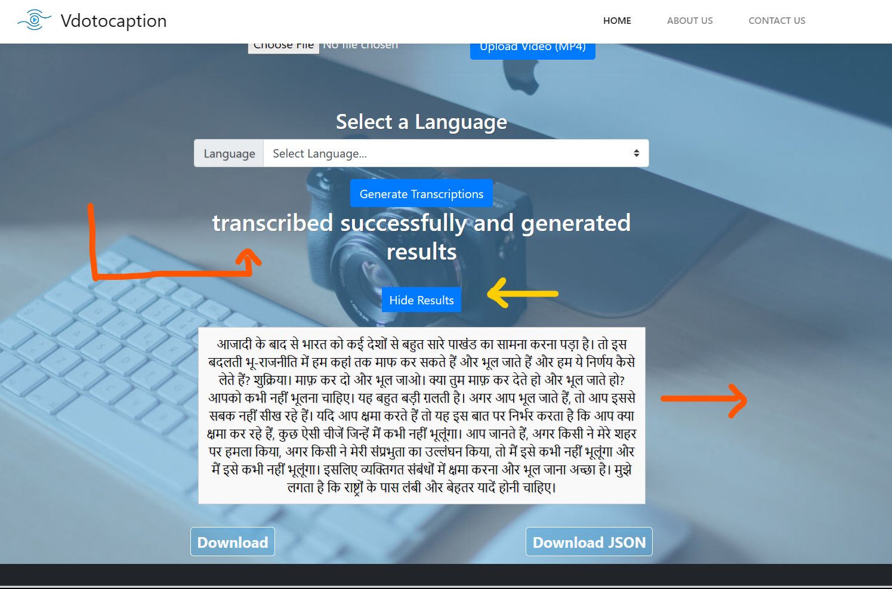

# VideoCaptioning
<b>Step 1:</b> Installation of Libraries and AWS cli. Disclaimer: The application of Premium will not run untill and unless you configure the aws cli
```
pip install -r requirements.txt
pip install awscli
aws configure

```
<b>Step 2:</b> Choose the method of service you want. This will depend upon what you want to achieve. See the below image and fucntionalities each of the choice provide.


<b>Step 3:</b> If you choose the Standard option then you will get only one file at a time to choose and to upload, then click on upload mp4 video file to upload. It is same for premium choice but it has options to choose for translation languages and batch uploads.


<b>Step 4:</b> Once successfully submitted, the confirmation msg will be shown.Now if you have choosed the premium choice then you have an additional language choice to translate the transcription into different languages.


<b>Step 5:</b> After the choice of language(can be empty if the transcription to be in english) now you click on generate transcription. After this wait for some time to show the successful generation of transcription.


<b>Step 6:</b> After the confirmation message arrives you can click on the View Result button to view the transcription generated there. You can toggle <i> view/Hide </i> of the results.



<b> Step7:</b> Now you can search for any of the words are there or not in the transcription by clicking on <b> Ctrl + F </b>. You can download the transcript and also the JSON file by clicking on the <b> Download and Download JSON buttons </b> respectively.


Navigate to Home, About Us, Contact Us buttons to find out more about it.